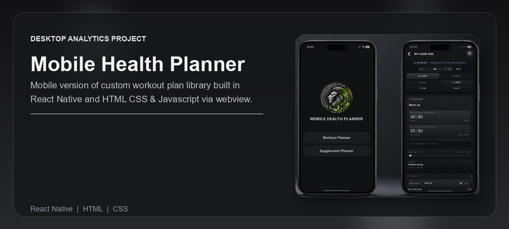
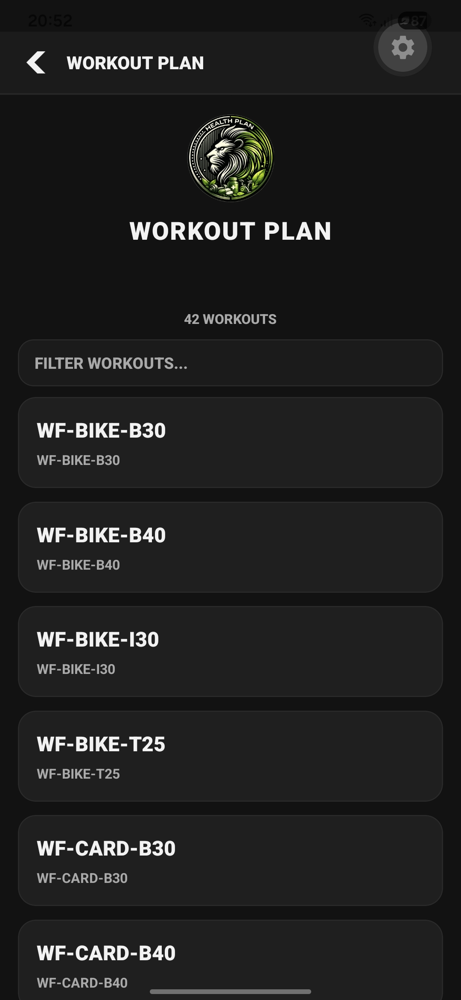
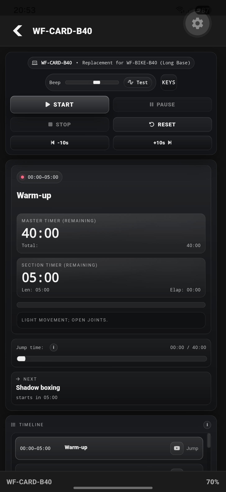
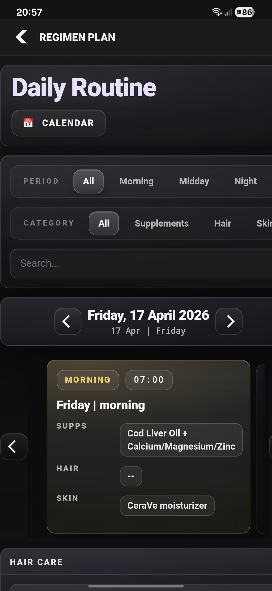

<div align="center">


<br /><br />

<p><strong>React Native health planning app for browsing workout routines and a static supplement schedule on mobile.</strong></p>

<p>Built as an Expo demo that packages local HTML workout plans and renders them inside a native mobile interface.</p>

<p>
  <a href="#overview">Overview</a> |
  <a href="#what-problem-it-solves">What It Solves</a> |
  <a href="#feature-highlights">Features</a> |
  <a href="#screenshots">Screenshots</a> |
  <a href="#quick-start">Quick Start</a> |
  <a href="#tech-stack">Tech Stack</a>
</p>

<h3><strong>Made by Naadir | May 2026</strong></h3>

</div>

---

## Overview

Mobile Health Planner is a React Native and Expo app that turns local workout HTML files into a mobile routine browser. It includes a searchable workout list, a WebView-based workout viewer, zoom controls, deep-link routing, and a simple supplement-plan page.

This public version is sanitized for portfolio sharing. Personal regimen data has been replaced with static demo content, generated private source folders have been removed from the public workflow, and Expo cloud identifiers have been stripped.

## What Problem It Solves

- Packages many local workout plans into a mobile-friendly list.
- Opens each plan in a WebView without needing a separate browser.
- Keeps routine browsing available offline once assets are bundled.
- Demonstrates deep-link navigation into different app sections.

### At a glance

| Track | Analyse | Compare |
|---|---|---|
| Workout HTML files | Asset loading state | Workout plans by routine code |
| Supplement schedule | WebView rendering | Local bundled content vs generated private content |
| Search and filtering | Matching routine names | Active routine vs full routine library |

## Feature Highlights

- **Workout browser**, listing bundled routine files from a static asset manifest.
- **Search filter**, quickly narrowing routines by code or title.
- **WebView viewer**, rendering local HTML workouts inside the app.
- **Zoom gesture**, adjusting workout page scale in the viewer.
- **Deep-link routes**, supporting home, workouts, and supplement-plan screens.
- **Sanitized demo regimen**, replacing private personal-care data with public-safe supplement examples.

### Core capabilities

| Area | What it gives you |
|---|---|
| **Workout assets** | Bundled HTML plans loaded through Expo Asset. |
| **Routine navigation** | Search, open, return, and refresh flows for many plans. |
| **Supplement demo** | A static public-safe schedule rendered in a WebView. |
| **Mobile shell** | Expo Go-compatible app structure for quick testing. |

## Screenshots

<details>
<summary><strong>Open screenshot gallery</strong></summary>

<br />

<div align="center">
  
  <br /><br />
  
  <br /><br />
  
</div>

</details>

## Quick Start

```bash
git clone https://github.com/Naadir-Dev-Portfolio/Mobile-Health-Planner.git
cd Mobile-Health-Planner
npm install
npx expo start
```

Open the project in Expo Go. No API keys are required for the public demo.

## Tech Stack

<details>
<summary><strong>Open tech stack</strong></summary>

<br />

| Category | Tools |
|---|---|
| **Primary stack** | React Native, Expo, TypeScript |
| **UI / App layer** | React Native views, `FlatList`, `react-native-webview` |
| **Data / Storage** | Bundled local HTML files and static TypeScript asset manifest |
| **Automation / Integration** | Expo Asset loading and deep-link handling |
| **Platform** | Android and iOS through Expo |

</details>

## Architecture & Data

<details>
<summary><strong>Open architecture and data details</strong></summary>

<br />

### Application model

`App.tsx` controls three screens: home, workout library, and supplement plan. Workout metadata is loaded from `workouts.generated.ts`, local HTML files are resolved with Expo Asset, and selected routines render in a WebView.

### Project structure

```text
Mobile-Health-Planner/
+-- App.tsx
+-- workouts.generated.ts
+-- regimen.bundle.ts
+-- assets/
|   +-- workouts/
+-- README.md
+-- repo-card.png
+-- portfolio/
    +-- mobile-health-planner.json
    +-- mobile-health-planner.webp
    +-- Screen1.png
    +-- Screen2.png
    +-- Screen3.png
```

### Data / system notes

- Personal regimen and hair-care data has been removed from the public version.
- No Expo cloud project ID, private build path, or generated private source folder is required.
- The workout HTML files are static bundled assets for demo purposes.

</details>

## Contact

Questions, feedback, or collaboration: `naadir.dev.mail@gmail.com`

<sub>TypeScript, React Native, Expo, WebView</sub>
